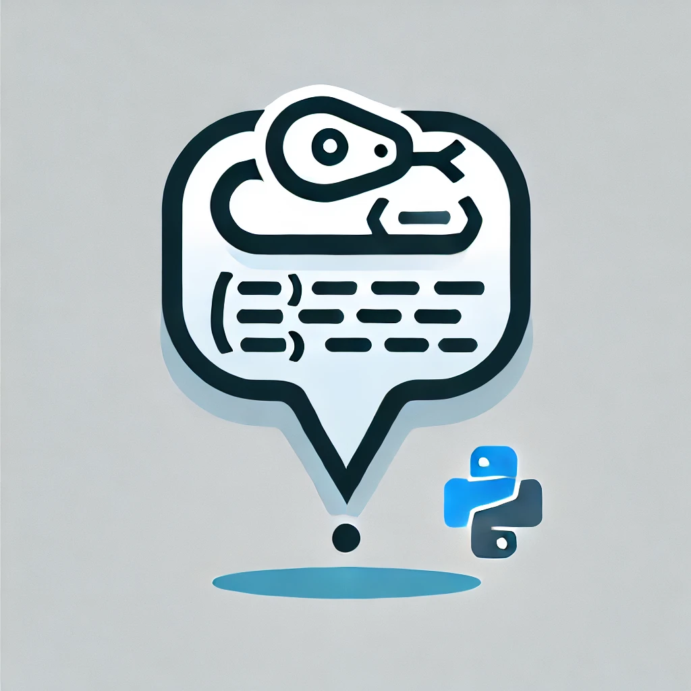

# Advanced Telegram Bot Template



A production-ready Telegram bot template built with aiogram 3.x, featuring PostgreSQL for data storage, Redis for state management, and webhook support with a local Telegram API server.

## Features

- 🚀 Built with aiogram 3.x
- 🔄 Webhook mode with local Telegram API server
- 📦 Docker containerization
- 💾 PostgreSQL with SQLAlchemy ORM
- 🔄 Redis for FSM and caching
- 🔐 Middleware system
- 📝 Alembic migrations with auto-apply
- 🎨 Modular architecture
- ⚙️ Environment-based configuration
- 🔒 Nginx reverse proxy
- 👥 Admin panel with broadcast feature
- 🔍 Comprehensive logging

## Tech Stack

- Python 3.11+
- aiogram 3.x
- PostgreSQL + asyncpg
- Redis
- SQLAlchemy + Alembic
- Docker & Docker Compose
- Nginx
- Local Telegram API server

## Project Structure

```
├── alembic.ini          # Alembic configuration
├── bot.py               # Main bot file
├── docker-compose.yml   # Docker services configuration
├── Dockerfile           # Bot image configuration
├── migrations/          # Database migrations
├── nginx/               # Nginx configuration
└── tgbot/               # Main bot package
    ├── config.py        # Configuration management
    ├── database/        # Database models and ORM
    ├── filters/         # Custom aiogram filters
    ├── handlers/        # Message handlers
    ├── keyboards/       # Keyboard layouts
    ├── middlewares/     # Middleware components
    ├── misc/            # Additional utilities
    └── services/        # Business logic services
```

## Installation

### Prerequisites

- Docker and Docker Compose

### Setup

1. Clone the repository:
```bash
git clone https://github.com/say8hi/TgBotTemplate.git
cd TgBotTemplate
```

2. Create .env file:
```bash
cp .env.example .env
```

3. Configure environment variables in .env:
```env
# Telegram Bot
BOT_TOKEN=           # Your bot token from @BotFather
ADMINS=              # Comma-separated admin user IDs

# PostgreSQL
POSTGRES_DB=         # Database name
POSTGRES_USER=       # Database user
POSTGRES_PASSWORD=   # Database password
POSTGRES_HOST=       # Host (postgres_db)

# Redis
REDIS_HOST=          # Redis host (redis)
REDIS_PORT=          # Redis port (6379)
REDIS_PASSWORD=      # Redis password

# Telegram API Server
TELEGRAM_API_ID=     # API ID for local server
TELEGRAM_API_HASH=   # API Hash for local server
TELEGRAM_LOCAL=1     # Use local API server

# Development
IN_DEVELOPMENT=     # Development mode (true/false)
```

### Running

1. Build and start containers:
```bash
docker-compose up -d --build
```

The bot will automatically:
- Check database connection
- Create initial migrations if not exist
- Apply pending migrations
- Detect and create migrations for model changes

## Configuration System

The bot uses a typed configuration system with dataclasses:

```python
@dataclass
class Config:
    tg_bot: TgBot         # Bot token and admin IDs
    postgres: Postgres    # Database configuration
    redis: Redis          # Redis configuration
    misc: Misc            # Additional settings
```

Configuration is loaded from environment variables with strong typing and validation.

## Features

### User Commands
- `/start` - Start the bot
- `👤Profile` - View user profile
- `❗️Info` - Get support information

### Admin Panel
- `/admin` - Access admin panel
- Broadcast feature with text and photo support
- User management
- Statistics

### Keyboard System

#### Inline Keyboards
```python
admin_menu = InlineKeyboardMarkup(
    inline_keyboard=[
        [
            InlineKeyboardButton(text="📬Broadcast", callback_data="broadcast"),
        ],
        [InlineKeyboardButton(text="✖️Close", callback_data="close")],
    ]
)
```

#### Reply Keyboards
```python
main_menu = ReplyKeyboardMarkup(
    resize_keyboard=True,
    keyboard=[
        [KeyboardButton(text="👤Profile"), KeyboardButton(text="❗️Info")],
    ],
)
```

## Database System

### Automatic Migrations

The bot includes an advanced migration system that automatically:

1. Checks database connectivity on startup
2. Creates initial migrations if database is empty
3. Detects model changes and creates new migrations
4. Applies pending migrations
5. Handles migration dependencies

All this happens automatically when you start the bot - no manual migration commands needed!

### Models
```python
class User(Base):
    __tablename__ = "users"
    
    id: Mapped[int]                      # Telegram user ID
    username: Mapped[str]                # Username
    registered_at: Mapped[datetime]      # Registration date
```

### ORM Usage
```python
# Create user
user = await AsyncORM.users.create(id=user_id, username="example")

# Get user
user = await AsyncORM.users.get(user_id)

# Update user
await AsyncORM.users.update(user_id, username="new_username")

# Get all users
users = await AsyncORM.users.get_all()
```

## Middleware System

### ConfigMiddleware
Injects configuration and Redis client into handler context.

### DatabaseMiddleware
Automatically:
- Creates new user records
- Updates usernames
- Adds user object to context

## Nginx Configuration

The project includes a pre-configured Nginx setup for the local Telegram API server:

- Token hiding in logs
- File serving optimization
- Gzip compression
- Extended timeouts
- Large file support
- Health checks

```nginx
upstream telegram-bot-api {
    server telegram-api-server:8081;
}

server {
    listen 80;
    server_name _;
    
    # Security and optimization settings
    chunked_transfer_encoding on;
    client_max_body_size 2G;
    client_body_buffer_size 30M;
    
    # Token hiding in logs
    set $sanitized_request $request;
    if ( $sanitized_request ~ (\w+)\s(\/bot\d+):[-\w]+\/(\S+)\s(.*) ) {
        set $sanitized_request "$1 $2:/$3 $4";
    }
}
```

## Development

### Adding New Handlers

1. Create a new file in `tgbot/handlers/`
2. Create and configure a router:
```python
from aiogram import Router

my_router = Router()

@my_router.message()
async def my_handler(message: Message):
    await message.answer("Hello!")
```

3. Add the router to `routers_list` in `tgbot/handlers/__init__.py`

### Creating New Models

1. Add model to `tgbot/database/models.py`
2. Create repository in `tgbot/database/orm.py`
3. The bot will automatically detect and apply changes on next restart

## Testing

For local testing:

1. Start:
```bash
docker-compose up -d --build
```

## Contributing

1. Fork the repository
2. Create a feature branch
3. Make your changes
4. Create a Pull Request

## License

MIT
